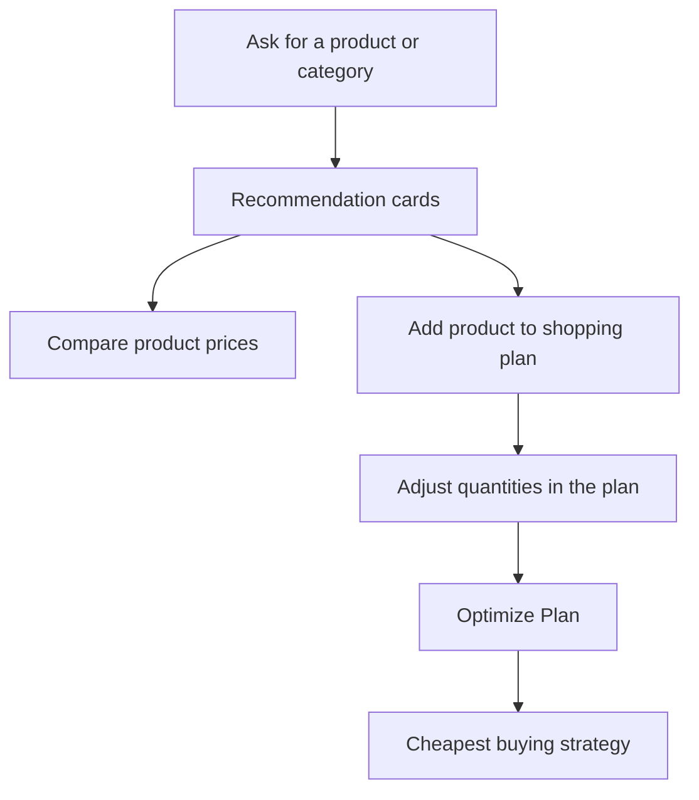

# Smart Cart — Shopping Decision Engine

Smart Cart is an in-progress full-stack shopping assistant. Instead of only
listing product prices, it helps a user make a purchasing decision:

1. ask for products or a category within a budget;
2. receive product recommendations;
3. compare a product across platforms;
4. add selected products to a shopping plan;
5. optimize the plan to find the lowest-cost buying strategy.

> **Project status:** Active development. The core client flows are working,
> but this is not yet a production-ready application.

## Current capabilities

- Natural-language assistant requests, such as `I need audio under 4000`.
- Category-and-budget recommendations from seeded product data.
- Single-product price comparison across platforms.
- Shopping-plan quantity controls: add, increase, decrease, and remove items.
- Cart optimization that compares a single-platform purchase with a split-cart
  purchase.
- Product validation, MongoDB persistence, error handling, and an
  authentication backend foundation.

## In progress / not complete

- Product prices are generated sample data, not live retailer prices.
- A MongoDB Atlas connection must be configured before backend API requests can run.
- Shopping plans are temporary browser state; they are not saved for a user
  after a refresh.
- Authentication is not yet fully connected to the client experience.
- Automated tests and deployment configuration are not yet set up.

## User journey



## Tech stack

| Area | Technology |
| --- | --- |
| Client | React `19.2.6`, TypeScript `6.0.2`, Vite `8.0.12` |
| Styling | Tailwind CSS `4.3.0` |
| Client HTTP | Axios `1.16.1` |
| UI icons | Lucide React `1.17.0`, React Icons `5.6.0` |
| Server | Node.js, Express `5.2.1` |
| Database | MongoDB with Mongoose `9.5.0` |
| Validation | Joi `18.2.1` |
| Authentication | JWT `9.0.3`, bcrypt `6.0.0`, cookie-parser `1.4.7` |
| Development | Nodemon `3.1.14`, ESLint `10.3.0` |

Versions above are taken from the current `package.json` files.

## Project structure

```text
price-comparator/
├── client/                 # React application
│   └── src/
│       ├── api/            # Axios API clients
│       ├── components/     # Chat screens and rich result cards
│       ├── context/        # User-level React state
│       ├── hooks/          # useAssistant state and actions
│       └── utils/          # Message and currency helpers
├── server/                 # Express and MongoDB application
│   ├── src/
│   │   ├── routes/         # API URLs
│   │   ├── controllers/    # HTTP request/response handling
│   │   ├── services/       # Comparison, recommendation, optimization logic
│   │   ├── repositories/   # MongoDB queries
│   │   ├── models/         # Mongoose schemas
│   │   └── middleware/     # Validation, auth, and error handling
│   └── scripts/            # Dummy-data generation and database seeding
└── decisions/              # Architecture and product decision notes
```

For a deeper walkthrough, see:

- [Client architecture](decisions/client.md)
- [Server architecture](decisions/server.md)
- [Product direction and phases](decisions/Phase.md)

## Local setup

### Prerequisites

- Node.js 20 or later
- npm
- A MongoDB Atlas database or local MongoDB instance

### 1. Install dependencies

```bash
git clone https://github.com/sucessdy/price-comparator.git
cd price-comparator

cd client && npm install
cd ../server && npm install
```

### 2. Configure environment variables

Create `server/.env`:

```env
PORT=3000
MONGO_URI=your-mongodb-connection-string
JWT_SECRET=use-a-long-random-secret
NODE_ENV=development
```

Create `client/.env`:

```env
VITE_API_URL=http://localhost:3000/api
```

Do not commit either `.env` file.

### 3. Generate and seed development data

```bash
cd server
npm run generate-data
npm run seed
```

> `npm run seed` replaces all existing products in the configured database.

### 4. Run the application

Open two terminals.

```bash
# Terminal 1
cd server
npm run dev
```

```bash
# Terminal 2
cd client
npm run dev
```

Open the Vite address printed in the second terminal, usually
`http://localhost:5173`.

## Useful commands

| Location | Command | Purpose |
| --- | --- | --- |
| `client/` | `npm run dev` | Start the Vite development server. |
| `client/` | `npm run lint` | Run frontend linting. |
| `client/` | `npm run build` | Type-check and create a production build. |
| `server/` | `npm run dev` | Start the Express server with Nodemon. |
| `server/` | `npm run generate-data` | Generate sample product data. |
| `server/` | `npm run seed` | Seed the configured MongoDB database. |

## API overview

| Method | Endpoint | Purpose |
| --- | --- | --- |
| `POST` | `/api/product` | Add or update a product. |
| `GET` | `/api/compare?product=name` | Compare one product across platforms. |
| `POST` | `/api/optimize-cart` | Find the lowest-cost cart strategy. |
| `POST` | `/api/assistant/chat` | Process a natural-language assistant message. |
| `POST` | `/auth/register` | Create a user account. |
| `POST` | `/auth/login` | Sign in. |

## Development focus

The next practical milestones are:

1. persist shopping plans with `localStorage` or user accounts;
2. add automated client and server tests;
3. improve category parsing and product matching;
4. connect live or regularly refreshed product-price sources;
5. configure a production deployment and secure cross-origin authentication.

---

Built as a learning project for designing a full-stack, decision-focused
shopping assistant.
