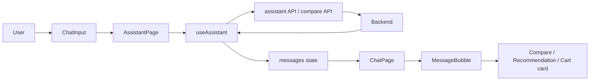

The frontend is the visible part of your app: it accepts user input, sends requests to the backend, stores chat state, and decides which card to show.
Frontend flow

Where the frontend starts
[main.tsx](/client/src/main.tsx) starts React.
It renders [App.tsx](/client/src/App.tsx), which wraps your app in UserProvider.
UserProvider is global user state: preferences, budget, and user-related data.
Your main page
[AssistantPage.tsx](/client/src/components/assistant/AssistantPage.tsx) is the main assistant screen.
It connects everything:
useAssistant()
↓
messages, input, loading state
↓
ChatPage + ChatInput
It decides which screen appears:
- No messages → LandingPage
- Messages exist → ChatPage and ChatInput
The important file: useAssistant
[useAssistant.ts](/client/src/hooks/useAssistant.ts) is the frontend’s main “brain.”
It stores:
messages        // Every user and assistant chat message
input           // What is currently typed
isLoading       // Whether an API request is running
shoppingPlan    // Products selected with Add to Plan
It also contains the important actions:
handleSendMessage
→ sends normal chat text to /api/assistant/chat

handleCompare
→ calls /api/compare for one product

handleAddToPlan
→ stores product + quantity in shoppingPlan
This is why you are coding this file: it keeps behavior and state in one reusable place rather than putting everything inside UI components.
How cards appear
[MessageBubble.tsx](/client/src/components/assistant/MessageBubble.tsx) checks the message type:
COMPARE        → CompareCard
OPTIMIZE_CART  → CartCard
SHOPPING_NEED  → RecommendationCard
So when the backend returns:
{
  intent: "SHOPPING_NEED",
  type: "recommendation",
  data: [...]
}
the frontend creates recommendation cards automatically.
Your card files
- [RecommendationCard.tsx](/client/src/components/assistant/cards/RecommendationCard.tsx)
  Shows suggested products. Its buttons call Compare and Add to Plan.
- [CompareCard.tsx](/client/src/components/assistant/cards/CompareCard.tsx)
  Shows prices for one product across platforms.
- [CartCard.tsx](/client/src/components/assistant/cards/CartCard.tsx)
  Shows the optimized plan returned by the backend.
- [ShoppingPlanCard.tsx](/client/src/components/assistant/cards/ShoppingPlanCard.tsx)
  Shows the products the user selected before optimization: boat earbuds × 1, milk × 2.
API files
These files only communicate with the backend:
- [assistant.api.ts](/client/src/api/assistant.api.ts)
  Sends a user’s chat message to the assistant backend.
- [productApi.ts](/client/src/api/productApi.ts)
  Calls direct comparison and cart-optimization APIs.
You separate these because UI components should not contain raw Axios code.
The feature you are currently building
RecommendationCard
→ Add to Plan
→ handleAddToPlan
→ shoppingPlan state
→ ShoppingPlanCard
→ Optimize Plan later
→ backend /api/optimize-cart
→ CartCard

-> AddToPlan data flow 

Add to Plan
      ↓
shoppingPlan = CartItem[]
      ↓
Optimize Plan
      ↓
await optimizeCart(shoppingPlan)
      ↓
createAssistantMessage()
      ↓
setMessages()
      ↓
CartCard appears
      ↓
setShoppingPlan([])

Recommendation
→ Add to Plan
→ quantity increases
→ plan displays selected items
→ remove decreases quantity
→ item disappears at × 0
→ Optimize Plan
→ backend calculates the best purchase strategy
→ CartCard shows the result