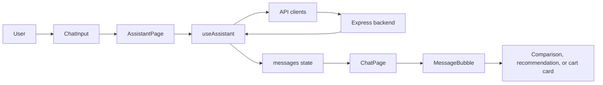
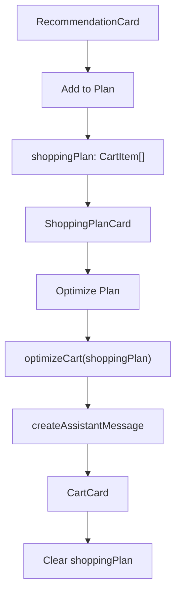

# Client Architecture

The client is the visible part of the Price Comparator. It accepts a user's
message, calls the backend when needed, stores temporary chat and shopping-plan
state, and renders the appropriate card for each assistant response.

## Application flow



## Entry point and page structure

- [`main.tsx`](../client/src/main.tsx) starts React and renders the app.
- [`App.tsx`](../client/src/App.tsx) wraps the application in `UserProvider`.
- `UserProvider` stores user-level data, such as preferences and budget.
- [`AssistantPage.tsx`](../client/src/components/assistant/AssistantPage.tsx)
  is the main assistant screen. It connects the state from `useAssistant` to
  `LandingPage`, `ChatPage`, `ChatInput`, and `ShoppingPlanCard`.

`AssistantPage` chooses the screen based on whether the conversation has
messages:

```text
No messages     → LandingPage
Has messages    → ChatPage + ChatInput + ShoppingPlanCard
```

## State and actions

[`useAssistant.ts`](../client/src/hooks/useAssistant.ts) is the main client
state hook. Keeping this logic in one hook lets presentation components stay
focused on rendering instead of API and state-management details.

| State or action | Responsibility |
| --- | --- |
| `messages` | Stores user and assistant chat messages. Messages are saved in browser `localStorage`. |
| `input` | Stores the text currently typed into the chat input. |
| `isLoading` | Prevents duplicate requests and displays a loading state. |
| `shoppingPlan` | Stores selected products as `CartItem[]`, including their quantities. |
| `handleSendMessage` | Sends a normal chat message to the assistant API. |
| `handleCompare` | Calls the direct product-comparison API for one product. |
| `handleAddToPlan` | Adds one quantity of a selected product to the shopping plan. |
| `handleRemoveFromPlan` | Removes one quantity; the product is removed only when its quantity reaches zero. |
| `handleOptimizePlan` | Sends the selected plan to the backend for cost optimization. |

Example shopping-plan data:

```ts
[
  { name: "boat earbuds", quantity: 1 },
  { name: "milk", quantity: 2 },
]
```

## Assistant message rendering

[`MessageBubble.tsx`](../client/src/components/assistant/MessageBubble.tsx)
uses the assistant message intent to select a rich card:

| Assistant intent | Rendered component |
| --- | --- |
| `COMPARE` | [`CompareCard`](../client/src/components/assistant/cards/CompareCard.tsx) |
| `OPTIMIZE_CART` | [`CartCard`](../client/src/components/assistant/cards/CartCard.tsx) |
| `SHOPPING_NEED` | [`RecommendationCard`](../client/src/components/assistant/cards/RecommendationCard.tsx) |

For example, a backend recommendation response has this shape:

```ts
{
  intent: "SHOPPING_NEED",
  type: "recommendation",
  data: [],
}
```

The client converts it to a `Message` and `MessageBubble` renders one or more
recommendation cards.

## Card responsibilities

| Component | Purpose |
| --- | --- |
| [`RecommendationCard`](../client/src/components/assistant/cards/RecommendationCard.tsx) | Displays a recommended product and provides **Compare** and **Add to Plan** actions. |
| [`CompareCard`](../client/src/components/assistant/cards/CompareCard.tsx) | Displays a product's prices across available platforms. |
| [`ShoppingPlanCard`](../client/src/components/assistant/cards/ShoppingPlanCard.tsx) | Displays selected products, supports quantity changes, and starts optimization. |
| [`CartCard`](../client/src/components/assistant/cards/CartCard.tsx) | Displays the optimized purchase strategy returned by the backend. |

## API clients

API code is separated from UI code so components do not need to contain Axios
requests or know backend URLs.

- [`assistant.api.ts`](../client/src/api/assistant.api.ts) sends normal chat
  messages to the assistant endpoint.
- [`productApi.ts`](../client/src/api/productApi.ts) calls the direct compare
  and cart-optimization endpoints.

## Shopping-plan flow



Quantity behavior:

```text
Add boat earbuds      → boat earbuds × 1
Add boat earbuds      → boat earbuds × 2
Remove one quantity   → boat earbuds × 1
Remove one quantity   → product is removed from the plan
```

## Current persistence behavior

- Chat messages persist in browser `localStorage`.
- The shopping plan is temporary client state. It is cleared after successful
  optimization and when the user clears the conversation.
- A future improvement can save the shopping plan in `localStorage` or in the
  backend for signed-in users.
