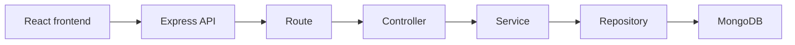

Your backend is the “brain” behind the UI. The frontend shows cards and buttons; the backend decides what data to return, reads products from MongoDB, and calculates the cheapest shopping option.
The big picture

Each layer has one job, which keeps the project organized.
Where the backend starts

[server.js](/server/server.js) is the entry point.
It:
- loads .env values such as MONGO_URI
- connects to MongoDB
- starts the server on port 3000
- handles graceful shutdown

Then it loads [app.js](/server/src/app.js), which prepares Express:
/api            → product routes
/api/assistant  → assistant routes
/auth           → login/register routes

Your main product flow
When a user asks to compare a product:
GET /api/compare?product=milk
This flow happens:

productRoutes.js
→ productController.js
→ productService.js
→ productRepository.js
→ Product model
→ MongoDB

- [productRoutes.js](/server/src/routes/productRoutes.js) defines the URL.
- [productController.js](/server/src/controllers/productController.js) gets request data and sends the response.
- [productService.js](/server/src/services/productService.js) contains business logic—finding the cheapest platform or optimizing a cart.
- [productRepository.js](/server/src/repositories/productRepository.js) speaks to MongoDB.
- [productModel.js](/server/src/models/productModel.js) defines what a product looks like in the database.

A product has:
{
  name: "boat earbuds",
  category: "audio",
  price: 734,
  platform: "reliance digital",
  priceHistory: []
}

category matters because your recommendation system searches by category plus budget.
The assistant flow
When a user types:
I need audio under 4000
The frontend sends:
POST /api/assistant/chat
The backend flow is:

assistantRoutes.js
→ assistantController.js
→ assistantService.js
→ queryParser.js
→ recommendationService.js
→ productRepository.js
→ MongoDB

- [queryParser.js](/server/src/utils/queryParser.js) extracts:
  - category: audio
  - budget: 4000
  - intent: SHOPPING_NEED
- [recommendationService.js](/server/src/services/recommendationService.js) finds suitable products under that budget and returns the best three.
The response becomes recommendation cards in your React chat.
Cart optimization flow
Later, when a user selects products in the shopping plan and presses Optimize Plan, the frontend will send:
[
  { name: "boat earbuds", quantity: 1 },
  { name: "milk", quantity: 2 }
]
to:
POST /api/optimize-cart
Then [productService.js](/server/src/services/productService.js) will:
1. find prices for all selected items;
2. calculate the cheapest platform for every item;
3. calculate delivery/platform fees from [platformConfig.js](/server/src/config/platformConfig.js);
4. compare:
   - buying all products from one platform;
   - splitting products across platforms;
5. return the cheaper choice.
That result is shown by your existing CartCard.

Why the extra folders exist
Folder	Why it exists
routes/	Defines API URLs.
controllers/	Handles request and response.
services/	Holds app decisions and calculations.
repositories/	Keeps database queries in one place.
models/	Defines MongoDB document shape.
validators/	Rejects invalid input before it reaches logic.
middleware/	Shared behavior: errors, validation, authentication.
utils/	Small reusable helpers such as query parsing and final-cost calculation.
scripts/	Generates and seeds dummy product data.

The files you will use most
- [assistantService.js](/server/src/services/assistantService.js): decides whether a chat message is compare, recommendation, or cart optimization.
- [queryParser.js](/server/src/utils/queryParser.js): understands phrases like “audio under 4000.”
- [productService.js](/server/src/services/productService.js): price comparison and final cart optimization.
- [recommendationService.js](/server/src/services/recommendationService.js): category + budget recommendations.
- [productRepository.js](/server/src/repositories/productRepository.js): actual MongoDB reads/writes. 