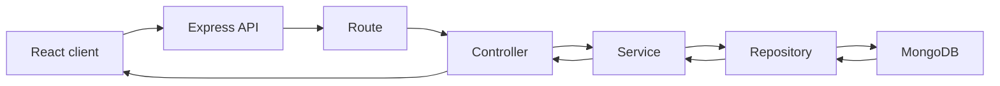
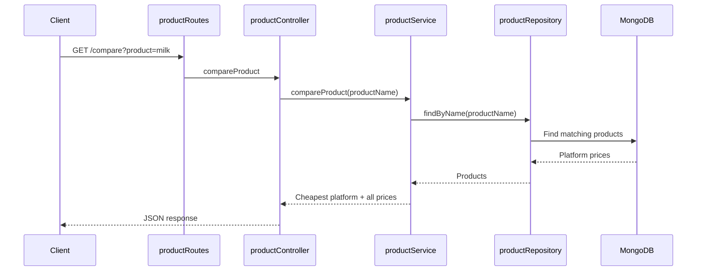
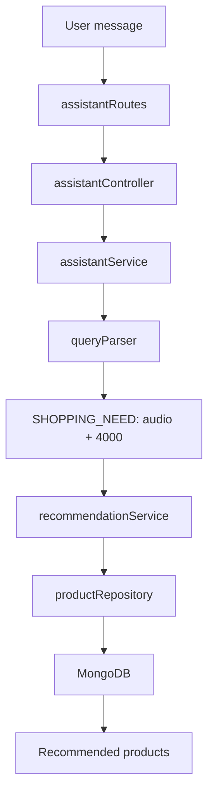

# Server Architecture

The server is the decision-making layer of the Price Comparator. The client
collects user input and renders cards; the server validates that input, reads
product data from MongoDB, recommends products, compares prices, and calculates
the cheapest way to purchase a shopping plan.

## Request lifecycle



Each layer has one responsibility. This keeps HTTP code, business decisions,
and database queries separate, so a change in one area is less likely to break
another.

## Starting the server

[`server.js`](../server/server.js) is the entry point. It:

- loads environment variables from `.env`;
- checks that `MONGO_URI` is present;
- connects to MongoDB;
- starts Express on `PORT` or port `3000`;
- handles shutdown signals and uncaught errors.

It loads [`app.js`](../server/src/app.js), which creates the Express
application and registers middleware and routes.

| Base path | Purpose |
| --- | --- |
| `/api` | Product comparison, product management, and cart optimization. |
| `/api/assistant` | Natural-language assistant messages. |
| `/auth` | Registration, login, tokens, and current-user endpoints. |

## Layer responsibilities

| Folder | Why it exists |
| --- | --- |
| [`routes/`](../server/src/routes) | Maps an HTTP method and URL to the correct controller. |
| [`controllers/`](../server/src/controllers) | Reads request data, calls a service, and sends an HTTP response. |
| [`services/`](../server/src/services) | Contains business rules such as choosing a strategy or handling an assistant intent. |
| [`repositories/`](../server/src/repositories) | Contains MongoDB queries only. |
| [`models/`](../server/src/models) | Defines MongoDB document structure with Mongoose schemas. |
| [`validators/`](../server/src/validators) | Rejects invalid request bodies before application logic runs. |
| [`middleware/`](../server/src/middleware) | Reusable request behavior: validation, authentication, authorization, and errors. |
| [`utils/`](../server/src/utils) | Small reusable helpers such as query parsing, response formatting, and cost calculation. |
| [`config/`](../server/src/config) | Database, JWT, and platform-fee configuration. |
| [`scripts/`](../server/scripts) | Generates and seeds development product data. |

## Product data model

[`productModel.js`](../server/src/models/productModel.js) defines the product
document saved in MongoDB:

```ts
{
  name: "boat earbuds",
  category: "audio",
  price: 734,
  platform: "reliance digital",
  priceHistory: [],
}
```

`category` is required because recommendations are based on **category +
budget**. A product without a category cannot reliably appear in category
searches or shopping-need recommendations.

## Product comparison flow

Example request:

```http
GET /api/compare?product=milk
```



Key files:

- [`productRoutes.js`](../server/src/routes/productRoutes.js) defines the endpoint.
- [`productController.js`](../server/src/controllers/productController.js) validates
  the product query and formats the response.
- [`productService.js`](../server/src/services/productService.js) selects the
  lowest product price.
- [`productRepository.js`](../server/src/repositories/productRepository.js)
  performs the MongoDB lookup.

## Assistant recommendation flow

Example user message:

```text
I need audio under 4000
```

The client sends:

```http
POST /api/assistant/chat
Content-Type: application/json

{ "message": "I need audio under 4000" }
```



[`queryParser.js`](../server/src/utils/queryParser.js) extracts:

```ts
{
  intent: "SHOPPING_NEED",
  category: "audio",
  budget: 4000,
}
```

[`recommendationService.js`](../server/src/services/recommendationService.js)
finds products in that category at or below the budget, sorts them by price,
and returns the top three results.

## Cart optimization flow

The frontend collects selected products in its shopping plan, then sends them
to the server:

```http
POST /api/optimize-cart
Content-Type: application/json

{
  "products": [
    { "name": "boat earbuds", "quantity": 1 },
    { "name": "milk", "quantity": 2 }
  ]
}
```

[`productService.js`](../server/src/services/productService.js) then:

1. normalizes duplicate items and quantities;
2. looks up prices for every selected product;
3. calculates a split-cart option, using the cheapest store for each product;
4. calculates every possible single-platform option;
5. applies delivery and platform fees from
   [`platformConfig.js`](../server/src/config/platformConfig.js);
6. returns the cheaper recommendation and shopping plan.

The frontend renders this response with `CartCard`.

## Validation, errors, and authentication

Before a controller runs, validation middleware checks the request body using
the appropriate Joi schema. For example:

- [`ProductValidators.js`](../server/src/validators/ProductValidators.js)
  validates products.
- [`optimiseValidators.js`](../server/src/validators/optimiseValidators.js)
  validates optimization requests.
- [`auth.validator.js`](../server/src/validators/auth.validator.js) validates
  registration and login requests.

Errors are passed to
[`error.middleware.js`](../server/src/middleware/error.middleware.js), which
returns consistent JSON error responses.

The authentication stack follows the same separation:

```text
userRoutes → authController → authService → userRepository → User model
```

JWT and refresh-token helpers live in
[`config/jwt.js`](../server/src/config/jwt.js) and
[`utils/tokenUtils.js`](../server/src/utils/tokenUtils.js).

## Development data

- [`generateData.js`](../server/scripts/generateData.js) creates realistic
  sample products with categories, prices, platforms, and price history.
- [`seedDB.js`](../server/scripts/seedDB.js) replaces product data in MongoDB
  with the generated sample data.

```bash
npm run generate-data
npm run seed
```

## Core design decisions

1. **Routes stay thin.** They only describe the API surface.
2. **Controllers handle HTTP.** They should not contain database queries or
   pricing algorithms.
3. **Services own decisions.** Comparison, recommendation, and optimization
   logic live here because they are app rules, not transport or storage code.
4. **Repositories isolate MongoDB.** If the database implementation changes,
   most business logic can remain unchanged.
5. **Validation happens early.** Invalid data is rejected before it reaches
   services or MongoDB.
